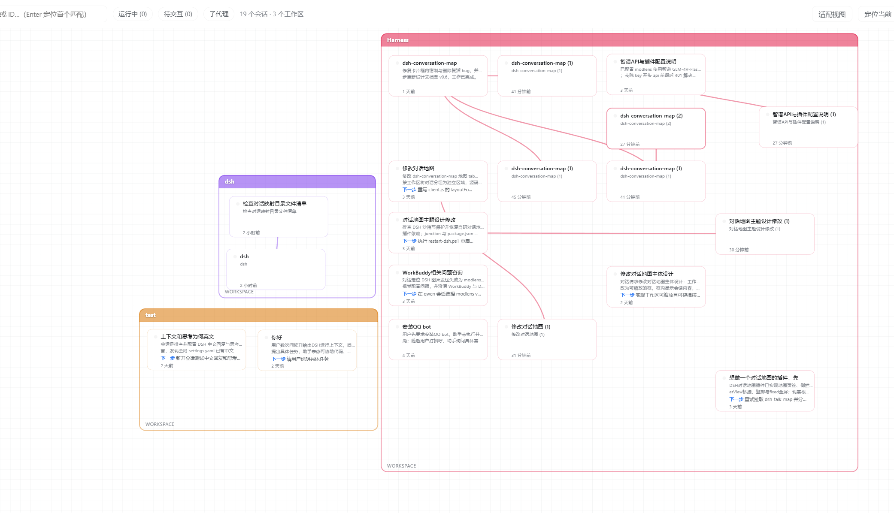

# dsh-conversation-map

Conversation map for DeepSeek Harness web: a live tree of every session in the workspace — subagent lineage, running state, and one-click navigation.

DSH 对话地图：当前工作区全部会话的实时树状图，子代理谱系、运行状态一目了然，双击即跳转。

> **v0.2.0** — 树状自动排版 + 工作区主题色贯穿 + 方格本便签风



## Features

- **树状自动排版**：会话按父/子关系自动排成树——父在左列，分叉的子会话向右逐层缩进，同层垂直排开，谱系结构一目了然
- **父子连线避让**：连线采样真实贝塞尔曲线，穿过的会话卡片会被自动挪到工作区内的最近空位，线永远清晰可见
- **工作区主题色贯穿**：工作区边框、会话卡片边框（选中/未选中深浅区分）、父子连线颜色全部继承工作区主题色
- **方格本画布**：背景为可随缩放平移的网格纸，工作区是透明的手绘感框框（无阴影）
- **自动扩容**：新建/分叉会话时，工作区框自动长高容纳，卡片不会重叠、不会溢出框外
- **实时状态**：运行中 / 待交互 / 空闲状态点
- **一键导航**：双击卡片跳转到对应会话
- **可缩放画布**：平移 / 缩放 / 拖拽摆放工作区框，位置持久化到 localStorage

## Install

```bash
dsh plugins add dsh-conversation-map
```

然后重启 `dsh web`，左侧栏底部出现「对话地图」入口。

## Usage

- 点击左下角「对话地图」打开地图 tab
- **双击会话卡片**跳转到该会话
- **分叉会话**：在对话里让 Agent 派生子代理（subagent），或悬停消息点分支图标 fork——地图上自动出现父子连线与树状分支
- 拖动工作区标题条移动整个工作区，拖角落调整大小
- 点击卡片查看摘要 / 关键结论 / 下一步

## Changelog

### v0.2.0

- 树状自动排版（groupTree 层级布局）：父左子右、同层垂直、自动避让不重叠
- 连线避让：贝塞尔采样检测 + 卡片就近疏散到工作区内空位（含 frame 自动扩容）
- 工作区主题色贯穿：边框/卡片/连线颜色继承，选中态深浅区分
- 卡片文字按视觉宽度截断（中文不再溢出边框）
- 去除会话数量徽章、卡片右上角刷新按钮、选中「当前」徽章
- 拖动工作区时边框颜色与静止一致
- 方格本背景 + 透明手绘感工作区

### v0.1.0

- 首个版本：按工作区分组的实时会话树状图
- 子代理谱系连线、运行状态点、双击跳转
- 工作区框可缩放、可拖拽摆放，位置持久化

## License

MIT
